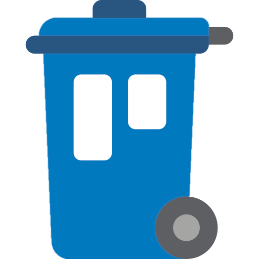
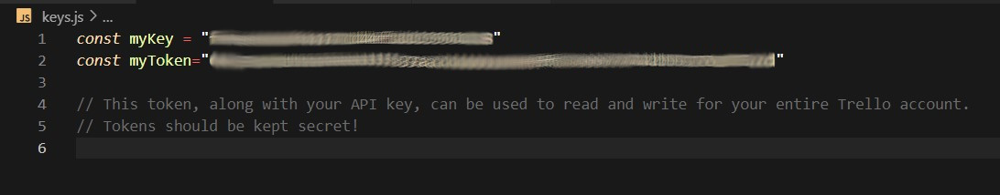
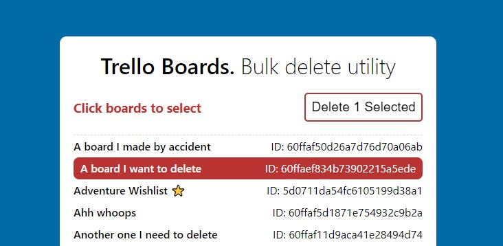

# Trello Cleanup

Table of content

  
## Table of Content
- [Summary](#summary)
- [Technologies](#technologies)
- [Instructions](#instructions)
- [Status](#status)
- [License](#license)  

## Summary
When I wanted to do a bulk cleanup of old unwanted Trello boards there was no easy way to do this in the native Trello Apps. To delete multiple boards, each one needed to be closed individually and in two separate operations (close, delete). This was slow and tedious. 
**This web app that allows you to quickly and easily delete multiple Trello boards in one step.** 

## Technologies
 

This project was built using [Axios](https://github.com/axios/axios) to query the [Trello REST API](https://developer.atlassian.com/cloud/trello/guides/rest-api/api-introduction/)

## Instructions

-  Clone this repo to your local machine.
-  Log into Trello (web) and find out [your own private API key and token](https://trello.com/app-key)
-  Create a new empty **keys.js file** in your new local project directory.
-  Save your key and token in your keys.js file, Assigned to **two variables: myKey** and **myToken**
-  Launch index.html in your browser.

**Note: As a safety feature, starred boards cannot be deleted.** 
If you want to delete starred boards you need to unstar them in Trello first. Alternatively, edit the code to disable this feature.

This app is built with JavaScript and uses the [axios library](https://github.com/axios/axios) to query the [Trello API](https://developer.atlassian.com/cloud/trello/guides/rest-api/api-introduction/).

---

## Status

## License

 
This project is licensed under the terms of the BSD 3-clause "New" or "Revised" license.
